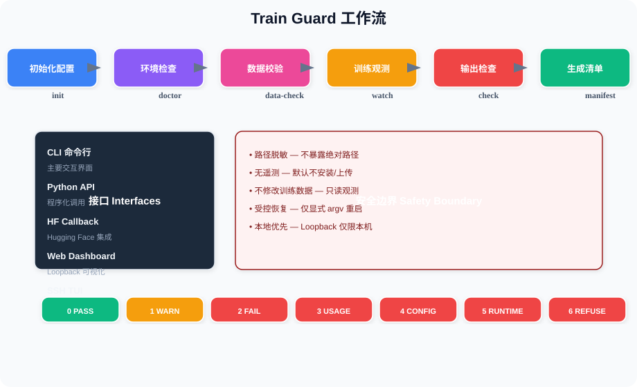

<p align="center">
  
</p>

<div align="center">


**LLM/VLM 训练守护 · 可靠观测与受控恢复**

[简体中文](README_zh-CN.md) · [CLI Reference](docs/CLI.md) · [Configuration](docs/CONFIGURATION.md) · [Reliability](docs/RELIABILITY.md) · [Architecture](ARCHITECTURE.md)

</div>


---


## ✨ Capabilities at a Glance

| 特性 | 说明 |
|------|------|
| 🔍 **训练前检查** | 环境、GPU、依赖、模型路径、数据集、媒体文件全面检查 |
| 👁️ **训练中观测** | 生命周期、日志、Loss、GPU、磁盘、检查点、进程监控 |
| 🛡️ **可靠性保障** | 结构化事件、去重告警、持久状态、有界恢复 |
| ✅ **训练后校验** | 输出验收、运行对比、评估、SHA256 清单 |
| 🖥️ **多端接口** | CLI、Python API、HF Callback、Web Dashboard、SSH TUI |
| 📦 **零依赖核心** | 无必需依赖的单文件发布，checksum 校验 |

## 🔄 工作流概览

<p align="center"></p>


---


[](https://github.com/Hyhyhyyy/train_guard/actions/workflows/ci.yml)
[](https://www.python.org/)
[](LICENSE)

[简体中文](README_zh-CN.md)

Train Guard is a local-first toolkit for LLM/VLM training checks, reliability events,
alerts, and explicitly controlled recovery. The core has no required dependencies.
Observation is the default: it does not install packages, upload telemetry, stop training,
or modify training data.

Current source release candidate: **0.6.0rc1**.

## Capabilities at a glance

- **Before training:** environment, GPU, dependency, model-path, dataset, media, and split checks.
- **During training:** lifecycle, log, loss, GPU, disk, checkpoint, and process observation.
- **Reliability:** structured events, deduplicated alerts, persistent state, and bounded recovery.
- **After training:** output acceptance checks, run comparison, evaluation, and SHA256 manifests.
- **Interfaces:** CLI, Python API, Hugging Face callback, loopback Web dashboard, and SSH TUI.
- **Delivery:** zero-required-dependency core plus a generated, checksummed single-file release.

## Install

The `train-guard` name on PyPI currently belongs to an unrelated project. Install this
repository from source so that the package origin is explicit:

```bash
git clone https://github.com/Hyhyhyyy/train_guard.git
cd train_guard
python -m pip install -e .
```

Optional extras are `yaml`, `image`, `psutil`, `tui`, and `all`:

```bash
python -m pip install -e ".[all]"
python -m pip install -e ".[tui]"
```

Update or remove the source installation with the same interpreter:

```bash
git pull --ff-only
python -m pip install -e ".[all]"
python -m pip uninstall train-guard
```

## Three-minute workflow

```bash
# 1. Create a generic, Transformers, or LLaMAFactory config.
train-guard init --template transformers --output train-guard.json

# 2. Replace placeholder paths, then validate environment and data.
train-guard doctor --config train-guard.json
train-guard data check --config train-guard.json

# 3. Observe training and verify outputs.
train-guard run watch --config train-guard.json
train-guard run check --config train-guard.json
train-guard manifest --config train-guard.json
```

To preserve every missing-media, invalid-media, and empty-answer finding, opt in to a local
JSONL ledger:

```bash
train-guard data check --config train-guard.json \
  --issues-jsonl ./reports/data-issues.jsonl
```

The ledger can contain media references, including absolute paths supplied by the dataset.
Treat it as sensitive and do not publish it with public reports.

For a source checkout use `python train_guard.py ...`; for the release asset use
`python train_guard.py ...` after downloading the attached single file.

## Interfaces and recovery

- **CLI:** the supported interface; see [docs/CLI.md](docs/CLI.md).
- **Unified launch:** `train-guard run launch` runs preflight, supervised training, live reliability
  collection, bounded recovery, post-training checks, and manifest generation with one run ID.
- **Web:** `train-guard show --state-db PATH` serves metrics, GPU state, alerts,
  checkpoints, recovery history, and managed-process status on loopback only.
- **TUI:** `train-guard tui --state-db PATH` provides the same persistent status over SSH.
- **Status:** `train-guard run status --state-db PATH` emits one scriptable snapshot.
- **Controlled recovery:** `run supervise` can restart only an explicit argv, only when
  `--restart` is supplied, only after checkpoint validation, and within a finite budget.
  It never executes a shell string. See [docs/RELIABILITY.md](docs/RELIABILITY.md).

The recommended entry point for a new run is:

```bash
train-guard run launch --output-dir ./outputs/run-1 --framework huggingface \
  --expected-steps 100 -- python train.py --output_dir ./outputs/run-1
```

It writes `train_guard_run_summary.json` plus doctor, watcher, audit, post-check, manifest,
and SQLite state artifacts. Add `--strict-preflight` only when an environment FAIL must prevent
training from starting. Framework-specific resume arguments remain part of the training argv.

For supervision without the full workflow:

```bash
train-guard run supervise --restart --max-restarts 1 \
  --checkpoint-dir ./checkpoint-100 \
  --required-checkpoint-file trainer_state.json \
  -- python train.py --resume-from-checkpoint ./checkpoint-100
```

The training argv itself must include its framework-specific resume option.

Control is disabled by default. Start a supervised run with `--enable-control`, then start
the Web dashboard with the same state database and `--enable-control`. The dashboard prints
an in-memory token once and accepts only capabilities advertised by that supervised process:

```bash
train-guard run supervise --enable-control --state-db ./guard.sqlite \
  -- python train.py
train-guard show --enable-control --state-db ./guard.sqlite
```

Supported controls are pause, resume, graceful stop, terminate, and validated restart. Checkpoint
creation remains framework-specific and is not exposed as a generic control action. Automatic
restart attempts and outcomes appear in the same recovery history as manual control requests.

The dashboard rejects non-loopback clients, non-local origins, expired commands, duplicate
command IDs, unmanaged processes, and unsupported capabilities. Do not proxy it publicly.

## Safety boundary and exit codes

Reports redact absolute paths, usernames, hostnames, and credential-like values. Public
HTML/JSON must not include raw samples or media bytes. Optional packages are never installed
automatically. Webhooks and exported telemetry are opt-in; users control their destinations.
Train Guard is a diagnostic aid, not a security sandbox, compliance system, or guarantee
that a training run is correct.

Stable process results are: `0` PASS, `1` WARN, `2` FAIL, `3` usage error,
`4` configuration error, `5` runtime error, and `6` refused overwrite.

## Topics

- [CLI reference](docs/CLI.md)
- [Configuration and precedence](docs/CONFIGURATION.md)
- [Reliability, Web, and recovery](docs/RELIABILITY.md)
- [Release process and artifacts](docs/RELEASE.md)
- [Migration and one-candidate alias window](docs/MIGRATION.md)
- [Architecture](ARCHITECTURE.md)
- [Contributing](CONTRIBUTING.md), [security](SECURITY.md), and [support](SUPPORT.md)
- [Changelog](CHANGELOG.md)

Licensed under the Apache License 2.0; see [LICENSE](LICENSE).


---

<div align="center">

Licensed under the Apache License 2.0 · see [LICENSE](LICENSE)

</div>
